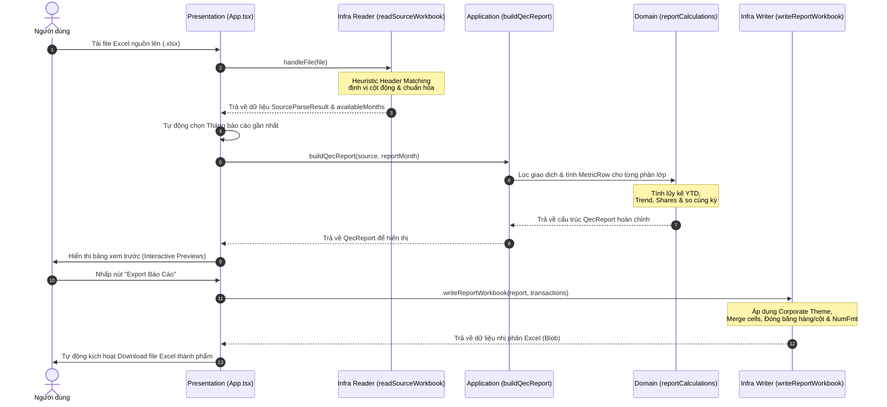

# 🏗️ Kiến trúc Phần mềm (Software Architecture)

Tài liệu này mô tả chi tiết thiết kế kiến trúc phần mềm của dự án **QEC Export Builder**. Dự án được xây dựng dựa trên nguyên lý **Clean Architecture** kết hợp với **Domain-Driven Design (DDD)** nhằm đảm bảo khả năng bảo trì, mở rộng và dễ dàng viết Unit Test cho các logic nghiệp vụ phức tạp.

---

## 🌟 Tại sao sử dụng Clean Architecture?

Đối với một ứng dụng xử lý dữ liệu báo cáo tài chính/kinh doanh như QEC, logic tính toán (các chỉ số tăng trưởng YTD, Trend, P3M, Share...) là tài sản cốt lõi quan trọng nhất của doanh nghiệp. Việc áp dụng Clean Architecture mang lại các lợi ích:

1. **Độc lập với UI/Framework:** Giao diện người dùng có thể đổi từ React sang Vue, Svelte hoặc chạy trên môi trường Command Line (CLI) mà không ảnh hưởng một dòng code nào của logic tính toán.
2. **Độc lập với Thư viện ngoài:** Thư viện đọc Excel (`exceljs`) có thể bị thay thế bởi thư viện khác nhẹ hơn trong tương lai, nhưng logic nghiệp vụ vẫn hoàn toàn tách biệt.
3. **Dễ dàng kiểm thử (Testability):** Toàn bộ core logic trong tầng `domain` là các hàm thuần khiết (Pure Functions), không phụ thuộc vào DOM, mạng hay tệp tin. Việc viết Unit Test chạy độc lập cực kỳ đơn giản và nhanh chóng.

---

## 📐 Chi tiết cấu trúc các Tầng kiến trúc (Architectural Layers)

Dữ liệu đi qua hệ thống theo cấu trúc phân tầng nghiêm ngặt. Tầng bên trong **KHÔNG ĐƯỢC PHÉP** biết thông tin hoặc phụ thuộc vào tầng bên ngoài (Dependency Rule).

```
 ┌─────────────────────────────────────────────────────────────┐
 │                    PRESENTATION LAYER                       │
 │    (React Components, CSS Layouts, Interactive Preview)    │
 └──────────────┬──────────────────────────────────────────────┘
                │
                ▼
 ┌─────────────────────────────────────────────────────────────┐
 │                     APPLICATION LAYER                       │
 │     (buildQecReport - Orchestrator of business flows)       │
 └──────────────┬──────────────────────────────────────────────┘
                │
                ▼
 ┌─────────────────────────────────────────────────────────────┐
 │                        DOMAIN LAYER                         │
 │  (entities.ts, month.ts, reportCalculations.ts - Core Rules)│
 └─────────────────────────────────────────────────────────────┘
                ▲
                │ (Implements / Consumes)
 ┌─────────────────────────────────────────────────────────────┐
 │                    INFRASTRUCTURE LAYER                     │
 │          (excelJS Parser, Excel Report Generator)           │
 └─────────────────────────────────────────────────────────────┘
```

### 1. Tầng Nghiệp vụ - Domain Layer (`src/domain/`)
Là trái tim của ứng dụng. Tầng này chứa định nghĩa các thực thể nghiệp vụ và quy tắc tính toán.
- **`entities.ts`**: Định nghĩa interface cho dữ liệu giao dịch nguồn (`SourceTransaction`), kết quả parse (`SourceParseResult`), các cấu trúc hàng báo cáo (`MetricRow`, `CustomerSection`) và báo cáo QEC hoàn chỉnh (`QecReport`).
- **`month.ts`**: Đảm nhận mọi phép toán liên quan đến chuỗi thời gian kinh doanh. Định nghĩa kiểu dữ liệu `MonthKey` dạng `YYYY-MM` (ví dụ: `2025-04`). Chứa logic tạo dải tháng so sánh (YTD), xác định tháng năm trước cùng kỳ, tính toán dải trung bình trượt (Trailing 3, 6, 9 months).
- **`reportCalculations.ts`**: Chứa các thuật toán tổng hợp số liệu theo phân khúc, sản phẩm và khách hàng. Tầng này thực hiện tính toán các chỉ số tài chính từ dòng dữ liệu thô:
  - Công thức tính **Xu hướng (Trend)**:
    $$\text{Trend} = \frac{\text{P3M} \times 2}{\text{P6M} + \text{P9M}}$$
  - Phân bổ tỷ trọng (Share), tính toán lũy kế YTD, tăng trưởng so với cùng kỳ (IYA).
  - Sử dụng hàm an toàn `safeRatio` để tránh lỗi chia cho 0 (`NaN` / `Infinity`).

### 2. Tầng Ứng dụng - Application Layer (`src/application/`)
Đóng vai trò là bộ điều phối (Orchestrator). Nó nhận yêu cầu từ giao diện, gọi các thành phần Domain để thực thi luồng công việc cụ thể.
- **`buildQecReport.ts`**: Nhận vào dữ liệu thô đã phân tích (`SourceParseResult`) cùng tháng báo cáo đích (`reportMonth`). Luồng thực hiện:
  1. Tính toán dải tháng báo cáo hợp lệ (từ tháng 1 năm trước đến tháng báo cáo).
  2. Lọc các giao dịch nằm trong dải tháng này.
  3. Phân nhóm doanh số theo phân khúc (`Segment`) để dựng bảng **QEC Review** (kèm tính Share đóng góp).
  4. Phân nhóm doanh số theo sản phẩm để dựng bảng **SKU Review** (sắp xếp giảm dần theo doanh số).
  5. Phân nhóm theo Khách hàng và Sản phẩm tương ứng để dựng 2 bảng **Customer Revenue** và **Customer Quantity**.
  6. Thống kê dữ liệu tổng quan và thu thập danh sách khách hàng chưa được ánh xạ (`Unmapped`).

### 3. Tầng Cơ sở hạ tầng - Infrastructure Layer (`src/infrastructure/`)
Chịu trách nhiệm giao tiếp với môi trường bên ngoài (trong trường hợp này là hệ thống tệp Excel của khách hàng).
- **`excelCellUtils.ts`**: Các hàm tiện ích thao tác với ô dữ liệu của ExcelJS (tránh lỗi định dạng ô là công thức, RichText hay Object liên kết). Chuẩn hóa chuỗi ký tự tiêu đề phục vụ khớp động.
- **`readSourceWorkbook.ts`**: Sử dụng cơ chế so khớp mềm tiêu đề (Heuristics) để đọc dữ liệu từ tệp nguồn. Cơ chế này duyệt qua 20 dòng đầu tiên của bảng tính để định vị dòng tiêu đề chứa các từ khóa cốt lõi, từ đó ánh xạ chỉ mục cột một cách linh hoạt mà không bắt buộc tệp Excel nguồn phải có cấu trúc cột cố định.
- **`writeReportWorkbook.ts`**: Chịu trách nhiệm tạo lập tệp Excel thành phẩm. Tạo ra workbook gồm 5 sheets:
  - `QEC review`: Bảng tổng hợp kênh/segment (đầy đủ định dạng %, Tiền tệ, đóng băng tiêu đề).
  - `SKU review`: Top 50 sản phẩm đóng góp doanh số cao nhất.
  - `SKU - Customer review`: Chi tiết doanh thu từng SKU theo từng nhà thuốc.
  - `SKU customer review`: Chi tiết số lượng hộp/lọ SKU tiêu thụ của từng nhà thuốc.
  - `Data nguồn`: Lưu trữ bản sao của dữ liệu thô phục vụ việc kiểm tra chéo (Audit Trail).

### 4. Tầng Giao diện - Presentation Layer (`src/presentation/`)
Chứa giao diện trực quan tương tác với người dùng.
- **`App.tsx`**: Quản lý trạng thái giao diện: upload file, phân tích trạng thái tiến trình (đọc file, xuất file), quản lý tab hiển thị (`qec` \| `sku` \| `customerRevenue` \| `customerQuantity`), hiển thị cảnh báo từ dữ liệu nguồn và kích hoạt tải xuống báo cáo dạng Blob.
- **`styles.css`**: Được thiết kế cao cấp và hiện đại dựa trên Vanilla CSS, tối ưu hóa tốc độ tải trang và sử dụng các hiệu ứng Hover, Transition, Keyframe mượt mà, cấu trúc Layout co giãn đáp ứng linh hoạt (Responsive Grid & Flexbox).

---

## 🔄 Quy trình Xử lý Dữ liệu (Data Flow Lifecycle)

Quy trình dữ liệu từ lúc tải file Excel nguồn lên đến khi xuất báo cáo kết quả trải qua các bước khép kín dưới đây:



---

## 🛠️ Giải pháp Thiết kế Kỹ thuật Đặc biệt

### 1. Phân tích Tiêu đề Mềm (Flexible Heuristic Matching)
Hầu hết các lỗi trong quá trình tự động hóa Excel đến từ việc thay đổi vị trí cột dữ liệu hoặc tiêu đề bị sửa (thêm dấu, thay đổi từ viết tắt). Dự án giải quyết triệt để vấn đề này bằng bộ lọc chuẩn hóa:
```typescript
export function normalizeHeader(value: string): string {
  return value
    .normalize("NFD")               // Tách các ký tự dấu tiếng Việt
    .replace(/[\u0300-\u036f]/g, "") // Loại bỏ hoàn toàn dấu
    .replace(/\s+/g, " ")            // Rút gọn nhiều khoảng trắng thành 1
    .trim()                          // Xóa khoảng trắng đầu cuối
    .toLowerCase();                  // Chuyển về chữ thường
}
```
Sau đó, hệ thống sử dụng thuật toán tìm kiếm từ khóa tương đồng để xác định đúng cột (ví dụ: cột Nhà Thuốc được chấp nhận nếu chứa cụm `nha thuoc` hoặc `customer`).

### 2. Định dạng Số và Dữ liệu Lớn trên Excel
Khi xuất báo cáo Excel, việc lưu giá trị dạng chuỗi (Text) làm người dùng không thể thực hiện tính tổng trên Excel. Dự án định cấu hình chính xác thuộc tính định dạng số (`numFmt`) cho từng cột tương ứng:
- Định dạng tiền tệ: `#,##0;[Red]-#,##0;"-"` (Hiển thị số âm màu đỏ, hiển thị số 0 thành dấu gạch ngang).
- Định dạng tỷ lệ tăng trưởng: `0.00%;[Red]-0.00%;"-"` (Hiển thị 2 chữ số thập phân).
Cách tiếp cận này vừa giữ nguyên kiểu dữ liệu số nguyên thủy (Number) phục vụ phân tích sâu trên Excel, vừa hiển thị giao diện báo cáo chuyên nghiệp.
