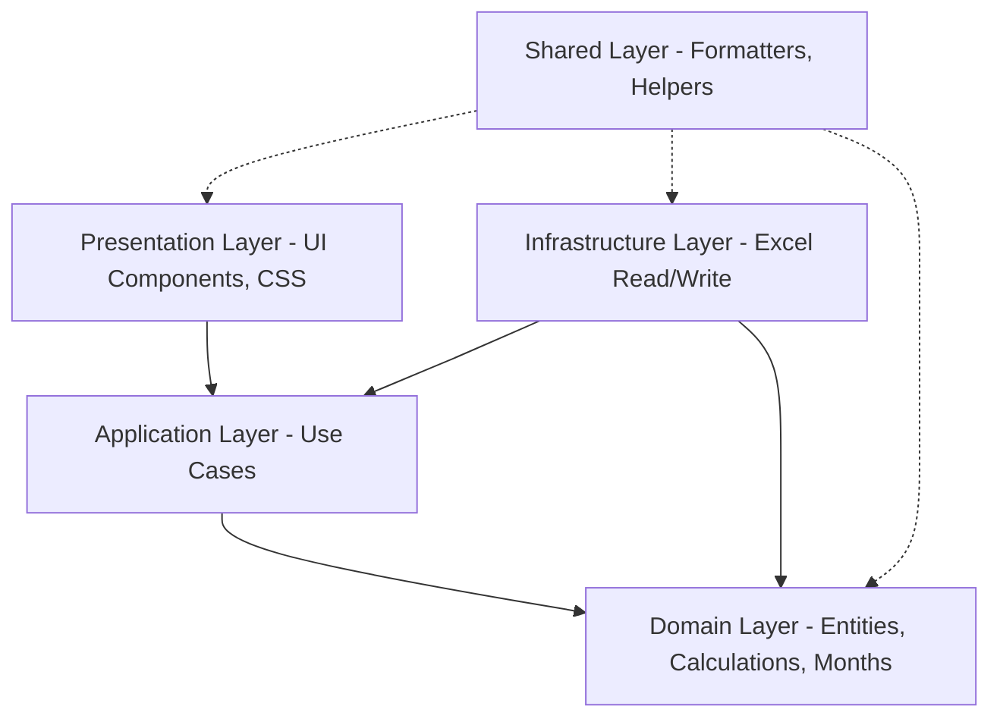

# 📊 QEC Export Builder

`QEC Export Builder` là công cụ client-side được xây dựng trên nền tảng **React 19**, **Vite** và **TypeScript** giúp xử lý, phân tích dữ liệu giao dịch bán hàng từ file Excel nguồn, tính toán các chỉ số kinh doanh cốt lõi (QEC, SKU, Khách hàng) và xuất báo cáo Excel thành phẩm được định dạng chuyên nghiệp theo chuẩn doanh nghiệp.

Ứng dụng tuân thủ kiến trúc **Clean Architecture** & **Domain-Driven Design (DDD)** giúp mã nguồn tách biệt hoàn toàn giữa logic nghiệp vụ (Domain), ứng dụng (Application), cơ sở hạ tầng Excel (Infrastructure) và giao diện người dùng (Presentation).

---

## 🚀 Tính năng nổi bật

- **⚡ Xử lý 100% phía Client:** Không gửi dữ liệu lên server, đảm bảo bảo mật tuyệt đối cho dữ liệu doanh nghiệp và xử lý siêu tốc.
- **🔍 Heuristic Header Auto-Detection:** Tự động nhận diện cấu trúc cột trong file dữ liệu nguồn thông qua cơ chế phân tích văn bản không dấu (Normalized headers). Nhận diện thông minh các cột: *Tháng, Nhà Thuốc, Phân khúc (Segment), Tên sản phẩm, Đơn giá, Số lượng, Thành tiền, Doanh thu*.
- **📊 Tính toán chỉ số chuyên sâu:** Tự động tính toán các chỉ số xu hướng và so sánh tăng trưởng doanh thu bao gồm:
  - **P3M/P6M/P9M:** Trung bình trượt của 3, 6, 9 tháng gần nhất.
  - **TREND:** Xu hướng biến động doanh số dựa trên tỷ lệ giữa ngắn hạn và trung/dài hạn.
  - **IFYTD / ICYTD:** Tỷ lệ tích lũy từ đầu năm tới tháng báo cáo so với cùng kỳ năm trước.
  - **IYA:** Chỉ số tăng trưởng của tháng báo cáo so với cùng kỳ năm trước.
  - **Share:** Tỷ trọng đóng góp doanh thu của từng Segment/SKU trong năm hiện tại và năm trước.
- **🖥️ Xem trước trực quan (Interactive Preview):** Xem ngay báo cáo chi tiết trực tiếp trên trình duyệt qua 4 tab: *QEC, SKU, Customer Revenue, Customer Quantity*.
- **📥 Xuất báo cáo Excel cao cấp:** Tạo file Excel (.xlsx) định dạng chuẩn, đóng băng dòng/cột, căn chỉnh tự động độ rộng, tô màu xen kẽ chuyên nghiệp và thiết lập định dạng số/phần trăm chuẩn xác thông qua thư viện `ExcelJS`.

---

## 🛠️ Công nghệ sử dụng

- **Core:** React 19.2 (Strict Mode), TypeScript 6.0, HTML5, Vanilla CSS với hệ thống CSS Variables tùy biến cao.
- **Build Tool:** Vite 8.0 (Nhanh và tối ưu hóa tốt).
- **Excel Processing:** `exceljs` 4.4.0 (Hỗ trợ định dạng styles, cell merge, number format sâu).
- **Icons:** `lucide-react` 1.16.
- **Testing:** `vitest` 4.1.7 (Chạy test nhanh với ES Modules).

---

## 📂 Kiến trúc dự án (Clean Architecture)

Thư mục mã nguồn `src` được chia làm 5 tầng kiến trúc rõ rệt:



### Chi tiết các tầng thư mục:

```
src/
├── domain/                  # 1. Tầng Nghiệp vụ (Core Business Logic)
│   ├── entities.ts          # Định nghĩa cấu trúc dữ liệu (Transaction, Report, MetricRow,...)
│   ├── month.ts             # Các hàm xử lý thời gian, tháng báo cáo, khoảng YTD, P3M/P6M/P9M
│   ├── reportCalculations.ts # Chứa logic tính toán công thức (Sum, Average, Trend, Share, Aggregate)
│   └── reportCalculations.test.ts # Bộ test bao phủ các công thức toán học doanh số
│
├── application/             # 2. Tầng Ứng dụng (Use Cases / Orchestration)
│   └── buildQecReport.ts    # Điều phối luồng xử lý: lọc giao dịch -> nhóm dữ liệu -> trả về QecReport
│
├── infrastructure/          # 3. Tầng Cơ sở hạ tầng (External Systems / Excel)
│   └── excel/
│       ├── excelCellUtils.ts # Tiện ích đọc dữ liệu ô Excel, xử lý kiểu dữ liệu, chuẩn hóa header
│       ├── readSourceWorkbook.ts # Đọc file Excel nguồn, tự động mapping cột bằng Heuristics
│       └── writeReportWorkbook.ts # Ghi báo cáo ra Excel, xử lý style, màu sắc, format số chuyên nghiệp
│
├── presentation/            # 4. Tầng Giao diện (React UI Components & Styles)
│   ├── App.tsx              # Component chính điều khiển trạng thái, tabs, xem trước dữ liệu và upload/export
│   └── styles.css           # Hệ thống CSS tùy biến cao với CSS Custom Properties, layout linh hoạt
│
└── shared/                  # 5. Tầng Dùng chung (Shared Helpers)
    └── formatters.ts        # Định dạng tiền tệ, tỷ lệ %, tiện ích download file blob phía client
```

---

## 🧮 Cơ chế tính toán các chỉ số kinh doanh

Mỗi dòng dữ liệu trong báo cáo phân tích (`MetricRow`) chứa giá trị chi tiết của từng tháng trong giai đoạn báo cáo kèm các cột tổng hợp và chỉ số tăng trưởng:

| Chỉ số | Ý nghĩa & Công thức toán học | Cách tính chi tiết |
| :--- | :--- | :--- |
| **Previous Year Total** | Tổng doanh số cả năm trước | Tổng của tất cả các tháng thuộc năm trước đó ($Y-1$). |
| **Current Year Total** | Tổng doanh số lũy kế năm nay | Tổng của tất cả các tháng từ tháng 1 đến tháng báo cáo năm nay ($Y$). |
| **Share Prev. Year** | Tỷ trọng năm trước | $\frac{\text{Previous Year Total của dòng}}{\text{Tổng Previous Year Total của toàn bộ bảng}}$ |
| **Share Curr. Year** | Tỷ trọng năm nay | $\frac{\text{Current Year Total của dòng}}{\text{Tổng Current Year Total của toàn bộ bảng}}$ |
| **P3M / P6M / P9M** | Trung bình trượt 3/6/9 tháng | Trung bình cộng giá trị của $3$, $6$, hoặc $9$ tháng tính ngược từ tháng báo cáo hiện tại. |
| **TREND** | Xu hướng bán hàng ngắn/trung hạn | $\text{Trend} = \frac{\text{P3M} \times 2}{\text{P6M} + \text{P9M}}$ (Giá trị > 1 biểu thị xu hướng tăng trưởng tốt ngắn hạn). |
| **IFYTD / ICYTD** | Tăng trưởng lũy kế đầu năm | $\frac{\text{Tổng doanh thu từ tháng 1 đến tháng báo cáo năm nay}}{\text{Tổng doanh thu từ tháng 1 đến tháng báo cáo năm trước}}$ |
| **IYA** | Tăng trưởng so với cùng kỳ | $\frac{\text{Doanh thu tháng báo cáo năm nay}}{\text{Doanh thu đúng tháng đó của năm trước}}$ |

---

## 🔎 Cơ chế tự động nhận diện cột (Heuristic Detection)

Tầng hạ tầng Excel sử dụng chuẩn hóa văn bản (loại bỏ dấu tiếng Việt, chuyển chữ thường, xóa khoảng trắng thừa) để tự động ánh xạ cột dữ liệu Excel bất kể thứ tự cột thay đổi. Các từ khóa được so khớp bao gồm:

- **Nhà Thuốc / Khách hàng:** `nha thuoc`, `customer`
- **Sản phẩm:** `ten san pham`, `product`
- **Doanh thu:** `doanh thu`, `revenue`
- **Số lượng:** `so luong`, `quantity`
- **Đơn giá:** `don gia`, `unit price`
- **Thành tiền:** `thanh tien`, `amount`
- **Phân khúc / Kênh:** `segment`, `phan khuc`, `kenh`
- **Thời gian (Tháng / Ngày):** `ngay`, `date`, `month`, `thang`

---

## 💻 Hướng dẫn chạy chương trình

### 1. Chuẩn bị môi trường
- Đã cài đặt **Node.js** (Khuyến nghị phiên bản 18 hoặc 20 trở lên).

### 2. Cài đặt các thư viện phụ thuộc
Mở terminal tại thư mục gốc dự án và chạy lệnh:
```bash
npm install
```

### 3. Khởi chạy chế độ phát triển (Development Server)
```bash
npm run dev
```
Sau đó truy cập địa chỉ hiển thị trên terminal (thông thường là `http://127.0.0.1:5173`) để mở giao diện web.

### 4. Chạy Unit Tests
Để kiểm tra tính đúng đắn của toàn bộ công thức toán học và logic tính toán báo cáo:
```bash
npm run test
```

### 5. Đóng gói sản phẩm (Production Build)
Để build phiên bản chạy thực tế siêu tối ưu:
```bash
npm run build
```
Thư mục `/dist` sẽ chứa toàn bộ tài nguyên web tĩnh (HTML, JS, CSS) sẵn sàng triển khai lên bất kỳ Hosting tĩnh nào (GitHub Pages, Vercel, Netlify).

---

## 📝 Quy chuẩn đóng góp mã nguồn (Guidelines)

Khi chỉnh sửa hoặc mở rộng dự án, hãy lưu ý:
1. **Domain logic:** Tuyệt đối không import bất kỳ dependency ngoài nào vào thư mục `src/domain` ngoại trừ các module nội bộ để giữ cho tầng nghiệp vụ luôn thuần khiết (Pure TypeScript).
2. **Styling:** CSS tuân thủ chặt chẽ nguyên lý responsive, không sử dụng Tailwind CSS bừa bãi. Sử dụng biến CSS tại `src/presentation/styles.css` để tinh chỉnh tông màu chủ đạo.
3. **Excel export:** Nếu thay đổi cấu trúc bảng báo cáo Excel, hãy nhớ cập nhật chỉ số cột tương ứng trong hàm `applyMetricFormats` của `writeReportWorkbook.ts` để tránh lỗi định dạng số hoặc lỗi tính toán của Excel.
